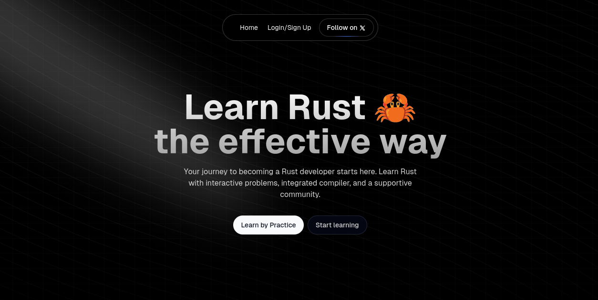

[](https://rustfinity.com)

# Rustfinity

<p>
  <a href="https://rustfinity.com"></a>
  <a href="https://github.com/dcodesdev/rustfinity.com/blob/main/LICENSE"></a>
  <a href="https://github.com/dcodesdev/rustfinity.com/issues"></a>
  <a href="https://github.com/dcodesdev/rustfinity.com/pulls"></a>
</p>

Rustfinity is an **interactive learning platform** dedicated to helping Rust developers of all levels learn and practice Rust programming concepts.  
**[Visit our website → rustfinity.com](https://rustfinity.com)** to explore challenges, tutorials, and everything you need to level up your Rust skills!

> **Why Rustfinity?**
>
> - **Hands-on Learning**: Practice your Rust skills with real challenges in a fun environment.
> - **Comprehensive Exercises**: From basics to advanced topics—there’s something for everyone.
> - **Engaging Community**: Contribute, discuss, and grow alongside other Rust enthusiasts!

---

## Table of Contents

- 🚀 [Getting Started](#getting-started)
- 📂 [Folder Structure](#folder-structure)
  - [challenges/](#challenges)
  - [crates/](#crates)
- 🤖 [Crates](#crates-details)
  - [cli](#cli)
  - [rustfinity-runner](#rustfinity-runner)
  - [syntest](#syntest)
- ❤️ [Contribute](#contribute)
- 🏠 [Local Development](#local-development)
- 🔗 [Follow Us](#follow-us)
- ⚖️ [License](#license)

---

## 🚀 Getting Started

1. **Head to [rustfinity.com](https://rustfinity.com)**  
   Explore available challenges and pick the ones you want to tackle.
2. **Try out the `cli` crate (optional)**  
   You can download challenges and practice them locally right from your terminal.
3. **Dive into the code**  
   Explore this repository to see how challenges and crates are structured.

---

## 📂 Folder Structure

```bash
.
├── challenges/
│   ├── beginners
│   ├── intermediate
│   └── advanced
└── crates/
    ├── cli
    ├── rustfinity-runner
    └── syntest
```

### <a name="challenges">challenges/</a>

This directory holds all the coding challenges served on [rustfinity.com](https://rustfinity.com). Feel free to submit new challenges, improve existing ones, or solve them locally using our CLI.

### <a name="crates">crates/</a>

This folder contains multiple Rust crates that power the Rustfinity platform.

---

## 🤖 <a name="crates-details">Crates</a>

### <a name="cli">`cli`</a>

- **What is it?**  
  The Rustfinity Command-Line Interface to help you **download, solve, and submit** Rustfinity challenges locally.
- **Key Features**
  - Download any challenge directly to your local environment
  - Run and test your solutions offline
  - Submit solutions without leaving your terminal

### <a name="rustfinity-runner">`rustfinity-runner`</a>

- **What is it?**  
  A crate designed for running challenge tests inside a secure Docker container.
- **Key Features**
  - Spins up a temporary Docker container to safely execute user code
  - Logs outputs and results from test runs
  - Ensures a clean environment for each challenge submission

### <a name="syntest">`syntest`</a>

- **What is it?**  
  A specialized testing library built on top of Rust’s [`syn`](https://docs.rs/syn) library to analyze and validate Rust code syntax.
- **Key Features**
  - Parse Rust AST (Abstract Syntax Tree) for testable patterns
  - Provides an easy interface for writing **syntax-based** tests
  - Helps ensure your Rust code meets style and syntactic guidelines

---

## ❤️ Contribute

We’d love your help! Whether it’s fixing bugs, adding challenges, or improving docs, every bit of help **matters**.

1. **Check out our [issues](https://github.com/dcodesdev/rustfinity.com/issues)**: Found a bug or want to suggest an enhancement? Open an issue!
2. **Fork & PR**: Fork the repo, make changes, and submit a pull request.
3. **Discussions**: Join the conversation in [GitHub Discussions](#) (coming soon) or on our community channels.

---

## 🏠 Local Development

Ready to hack on Rustfinity locally? Here’s how:

```bash
# 1. Clone the repository
git clone https://github.com/dcodesdev/rustfinity.com.git
cd rustfinity.com

# 2. (Optional) Switch to a new branch for your work
git checkout -b my-new-feature

# 3. Explore and build
cargo build
```

We recommend installing [Docker](https://www.docker.com/) if you want to test the `rustfinity-runner` crate in a containerized environment.

---

## 🔗 Follow Us

Stay updated with the latest challenges, features, and announcements!

<p>
  <a href="https://x.com/rustfinity"></a>
  <a href="https://github.com/dcodesdev/rustfinity.com"></a>
  <a href="https://discord.gg/8GRcUqY48B"></a>
</p>

---

## ⚖️ License

This project is licensed under the [MIT License](https://github.com/dcodesdev/rustfinity.com/blob/main/LICENSE).  
Go build something awesome with Rust—**we’re rooting for you!** 🚀
